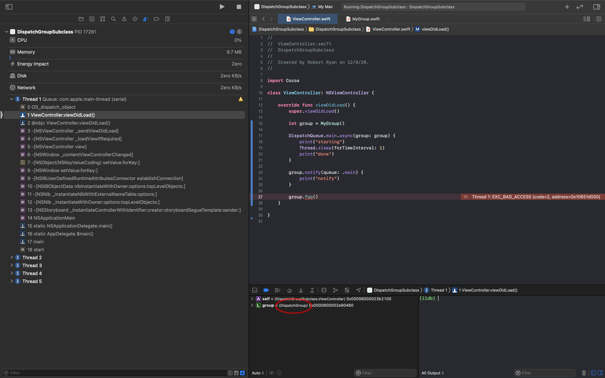

#  DispatchGroupSubclass

`DispatchGroup` is defined as an `open` class, but it does not permit subclassing. For example, I subclassed, defined a method in that subclass, and attempting to call that method results in an `EXC_BAD_ACCESS`:

Also note that in the debug “Variables View”, that my `group` variable is reported as a `DispatchGroup`, not as my subclass, `MyGroup`.

I am familiar with the legacy of GCD API and types, and assume that it cannot easily be refactored to support subclassing. I would therefore suggest:

* Declare `DispatchGroup` to be `final`, rather than `open`, to have the compiler prevent attempts to subclass it.
* Update the documentation for `DispatchGroup` to make it clear that it cannot be subclassed.

---

Rob Ryan
8 December 2020
